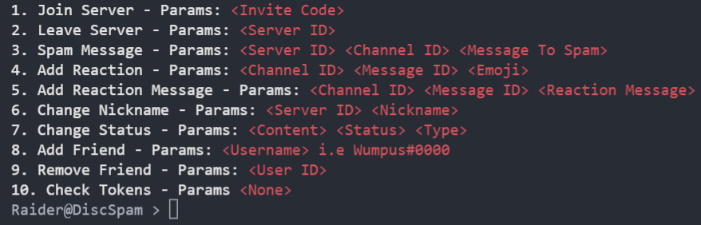

<br/>
<p align="center">
  <h1 align="center">DiscSpam</h1>

  <p align="center">
    Fast, Free, Easy to use Discord.com raid tool
    <br/>
    <a href="https://github.com/Sympthey/DiscSpam/issues">Report Bug</a>
    ,
    <a href="https://github.com/Sympthey/DiscSpam/issues">Request Feature</a>
  </p>
</p>


## About The Project



There are a few Discord raid tools on GitHub, however, I didn't find that they suited my use case so I decided to make my own one, a much better one then any online at the moment. This tool aims to be the one and only raid tool you need.

Some unique features:
* When developing this tool the Discord API endpoints were reversed but also some of the function it uses like the X-PROPERTIES header that is passed to identify the device have been recreated.
* The chances of your tokens getting phone locked or terminated from this tool are next to none.
* Cloudflare checking has been reversed and implemented into this tool. On the server side discord will see your requests as a legitimate user using the discord client.

## Built With

This tool has been created in [Go](https://golang.org/). For the speed and concurrency it is also using thread safe go routines these can be spawned, used and destroyed very fast whilst also being really friend on the computer resources.

## Getting Started

Getting started is really simple. Head over the the [release](https://github.com/Sympthey/DiscSpam/releases) page and download the correct version of the program for your operating system. 

Once you have downloaded the correct version of the program just add all your discord tokens into the `tokens.txt` file and then run the program.

### Installation

1. Install [Go](https://golang.org/)

2. Clone the repo
```sh
   git clone https://github.com/Sympthey/DiscSpam.git
```

3. Install Go Modules
```sh
   go install
```

4. Compile Code
```sh
   go build
```

5. Add Tokens
```sh
   Add the Discord tokens to tokens.txt
```

6. Run Program
`Simply run the executable file if you're on windows or run the binary files of you're on Linux`

### Creating A Pull Request

1. Fork the Project
2. Create your Feature Branch (`git checkout -b feature/AmazingFeature`)
3. Commit your Changes (`git commit -m 'Add some AmazingFeature'`)
4. Push to the Branch (`git push origin feature/AmazingFeature`)
5. Open a Pull Request

### Roadmap
1. Add Proxy Support
2. Add Friend Request Support
3. Voice Chat Spammer
4. Token Checking Built In
5. Create And Train Captcha Solver
6. Support Fake Typing

These are just some things I am going to be adding to the tool very soon. If you have any ideas feel free to open a [issue](https://github.com/Sympthey/DiscSpam/issues) request and let me know.
    


## License

Distributed under the MIT License. See [LICENSE](https://github.com/Sympthey/DiscSpam/blob/main/LICENSE.md) for more information.

